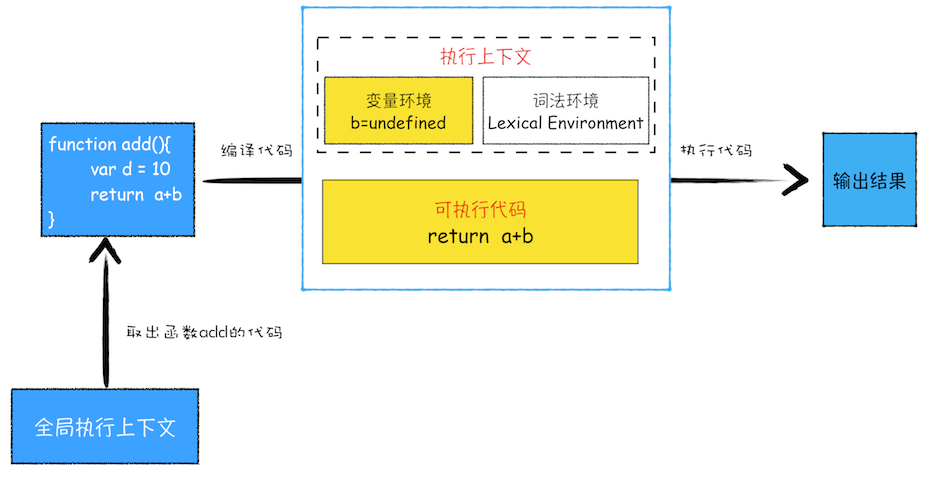
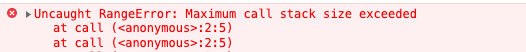

# 函数调用栈

### 分析该代码的执行过程
```js
var a = 2
function add(){
    var b = 10
    return  a+b
}
add()
```
### 1.编译阶段
1. 编译整体代码（注意：不包含`add`内部代码，当函数执行时才会生成上下文），生成全局上下文对象。全局上下文对象中包含`i、add`
```text
globalEnv:
    a: undefined
    add: fn
```
2. 执行`add`时，先去全局环境中取出`add`代码。然后对这段代码进行编译，并创建该函数的执行上下文和可执行代码，最后执行，输出结果。
```text
fnEnv:
    b: 100
```

整体流程如下：



从以上的执行过程我们可知，在`js`代码执行过程中，不只有一个执行上下文对象。那么`js`是如何管理这些上下文对象的呢？

**js使用栈结构管理多个上下文对象**

## 栈
### 概念
栈可以理解为一个瓶子，只有一端开口，先进去的总是最后出来。栈遵循 **"后进先出"** 的原则。
### js中的栈
**`js`中的多个上下文正是用栈结构来管理的。**在执行上下文创建好后，`js`会将执行上下文压入栈中，一般把这种栈叫做"调用栈"**。**当函数调用完毕后，会立即将其上下文从调用栈中弹出。**

#### 分析代码执行过程
```js
var a = 2
function add(b,c){
    return b+c
}
function addAll(b,c){
    var d = 10
    result = add(b,c)
    return  a+result+d
}
addAll(3,6)

```
具体执行过程可访问：[链接](http://interview.poetries.top/fe-base-docs/browser/part2/lesson08.html#%E4%BB%80%E4%B9%88%E6%98%AFjavascript%E7%9A%84%E8%B0%83%E7%94%A8%E6%A0%88)

### 栈溢出Stack Overflow
**由于栈是有大小的，所以当执行的上下文对象数量超过`js`栈最大值时，会报栈溢出的错误。** 这种错误常常出现在递归时：
```js
function call(){
    call();
}

call();
```


## 总结
- 在调用函数时，`js`引擎会为其创建上下文对象，并压入调用栈，然后再执行代码
- 如果在函数`A`中调用了函数`B`，那么`js`会为`B`函数创建执行上下文,并将`B`函数的上下文压入栈顶。
- 当前函数执行完毕后，会将当前函数的上下文从调用栈弹出
- 当分配的调用栈空间被占满时，会引发“堆栈溢出”问题。

