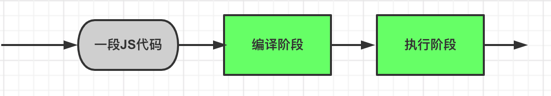
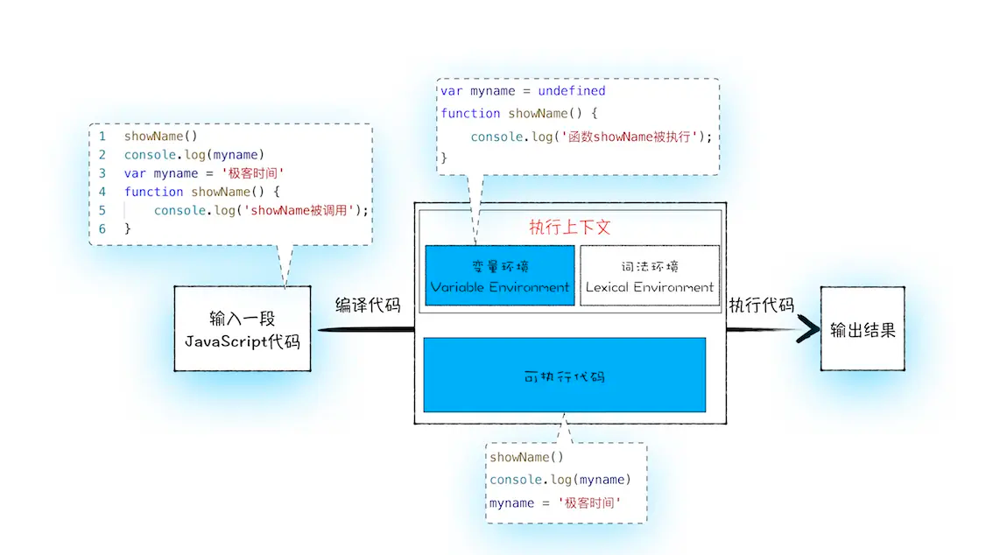

# JS变量提升（Hosting）
`js`是按照顺序执行的语法，但是实际运行会和"顺序执行"这个定义相悖，在这里涉及到了变量提升等概念。
## 变量的声明和赋值
### 变量
```js
var obj = {name: 'test'};
```
以上的`js`语法可以分解为以下两步：
1. 声明变量：`var obj;`
2. 赋值：`obj = {name: 'test'}`
### 函数
```js
function foo(){
    console.log(1);
}
// 完整的函数声明，也就是说并没有涉及到赋值操作
```
```js
var foo = function(){};
// 函数表达式：(1）先声明`foo`变量  (2）赋值，将函数赋值给变量
```

## 变量提升
**变量提升指：在`JS`代码执行过程中，`JS`引擎把变量的声明部分和函数整体提升到代码开头的"行为"。** 变量被提升后，会设置其默认值为`undefined`。
```js
/* 变量提升部分 */
// 把变量 myname提升到开头，
// 同时给myname赋值为undefined
var myname = undefined
// 把函数showName提升到开头
function showName() {
    console.log('showName被调用');
}

/*可执行代码部分*/
showName()
console.log(myname)
// 去掉var声明部分，保留赋值语句
myname = 'name'
```
## js执行过程
实际上，`js`的执行过程分为`编译阶段`、`执行阶段`。**其中变量提升的过程发生在其编译阶段**，当编译结束，代码才会开始执行。

### 1.编译阶段
```js
showName()
console.log(myname)
var myname = 'name'
function showName() {
    console.log('函数showName被执行');
}
```
以上代码为实例：

当输入一段`js`代码编译后，会生成两部分内容：
1. 执行上下文（执行一段代码时的运行环境，比如：调用一个函数，就会进入这个函数的执行函数上下文，确定该函数在执行期间用到的诸如`this`、变量、对象等）
   - 环境变量（存放`function`声明、`var`声明的变量）
   - 词法环境（存放`let`、`const`声明的变量等）
2. 可执行代码

#### 生成上下文对象（环境变量）过程
- 当遇到`var`声明的变量，`js`引擎会在环境变量创建对应的变量，将其设置为`undefined`
- 当遇到函数声明时，`js`引擎会将函数定义储存在堆（`HEAP`）中，并在环境变量中创建变量，将其值指向堆中的地址。

### 2.执行阶段
执行阶段期间，`js`引擎是一行一行的执行代码，当遇到变量时，会去其对应的上下文中对象中寻找变量并取出其值，如果找不到则会报错`Uncaught ReferenceError: xxx is not defined`



## 生成上下文的几种情况
什么`js`代码才可以创建`js`上下文呢？一般有下面三种情况
- 执行全局代码
    - 执行全局代码时，会编译全局代码并创建全局执行上下文，而且在整个页面的生存周期内，全局执行上下文只有一份。
- 调用函数
    - 当你调用函数时，函数内部的代码会被编译，并创建函数上下文。一般情况下，函数执行结束后，创建函数的上下文会被销毁。
- 执行`eval`函数
    - 当使用`eval`函数时，`eval`代码也会被编译，并创建执行上下文。

## 总结
- 输入一段`js`代码后，会有两个阶段
  - 编译阶段：变量和函数声明会存放到上下文对象中，变量的默认值会被设置为`undefined`（变量提升）
  - 执行阶段：代码按照顺序执行，遇到变量后，`js`引擎会去上下文对象中去寻找自定义变量和函数。如找到输出对应值，若找不到则会报错。
- 如果在编译阶段，存在两个相同的函数命名，那么后面的会覆盖前面的函数。
