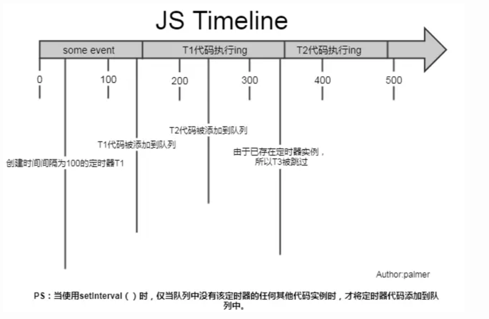

# setTimeout vs setInterval vs requestAnimationFrame

## 前置知识
### 1. 计算机屏幕刷新率与浏览器重绘次数
- 屏幕刷新率指`1s`内屏幕刷新的次数。
- 一般的电脑的屏幕刷新率为`1s 60次`(`1000ms / 60 ≈ 16.7ms` | `60FPS`)，也就是每`16.7ms`会刷新一下屏幕。当然此数值受到分辨率、显卡、屏幕尺寸等其他因素的影响。
- 由于一般的电脑的刷新频率是`60FPS`，所以大多数浏览器会限制其重绘次数，一般不会超过计算机的重绘次数，因为即使超过了其频率，用户的体验也不会得到提升。

### 2. 动画是如何形成的？
动画是由于肉眼导致的视觉残留，通过连续播放的静态图像形成的动态幻觉。**当`1s`中连续播放24张图片时(`24FPS`)，即可形成流畅的动画**。

### 3.web实现动画的方式
- `css`：`animation`、`transition`
- `js`: `setTimeout`、`setInteval`
- `html`: `canvas`、`svg`
- `requestAnimationFrame`等...

本文将重点介绍`setTimeout`、`setInterval`、`requestAnimationFrame`这三种`API`。
## setInterval
`setInterval`方法按照指定的周期（毫秒）来调用函数或计算表达式。
> 敲重点：定时器指定的时间间隔，表示的是何时将回调函数添加到消息队列，而不是何时执行代码。
> 真正何时执行代码的时间是不能确定的，取决于该回调函数何时被主线程的事件循环取到，并执行。
### 参数
- `function/code`
    - 【必需】要重复调用的函数/字符串。当为字符串时，会被编译为`js`代码执行。
- `delay`
    - 【必需】周期性调用`function/code`的时间间隔，以毫秒计数。
    - 注：`HTML5`规定，执行时间间隔最小为`10`当小于`10`时，默认为`10`。
- `args1... argsN`
    - 【非必需】传递给执行函数的参数
### 缺点
#### 1.存在无用调用，浪费性能
会一直不停的执行函数，**即使将浏览器最小化，或者切换到另一个`tab`，定时器还依旧会继续在后台执行**。除非关闭网页才会停止调用。
#### 2.忽略错误代码，即使出错还会调用
`setInterval`中执行的代码如果出错，不会停止运行，而是继续调用。
#### 3.无法保证调用的时间间隔；某次回调可能会被跳过
> 敲重点：`setInterval`每次将回调函数推入异步队列前，会检查异步队列中是否有**该定时器的代码实例**，如果存在，则不会添加本次回调函数。

如果回调函数的执行需要花费很大时间执行，某些处于中间的调用会被忽略。

例：分析如下代码执行步骤
```text
...some event...
setInterval(T, 100);
// 代表每100ms将T函数推入异步队列中
```

1. 代码开始执行，先执行`some event`同步代码，`100ms`后将`T1`添加到异步队列的尾部；
2. 此时主线程依旧有`event`任务在执行，所以无法立即执行`T1`。只能待主线程任务结束后，执行`T1`；
3. 又过了`100ms`，`T1`在主线程执行，此时将`T2`添加到异步队列尾部，由于`T1`还在执行，所以`T2`只能等待执行；
4. **又过了`100ms`，此时本应该将`T3`添加到异步队列尾部，但是由于异步队列中存在`T2`,所以`T3`不会被添加到队列中（被跳过）。**
5. `T1`执行完毕后，立即从异步队列中取出`T2`执行（并没有达到定时器的效果）

由以上的例子我们可以看出`setInterval`的两个缺点：
1. 某些极端情况下，无法保证按照时间间隔运行回调函数；
2. 当回调函数执行时间过长时，某次的回调可能被直接忽略。
