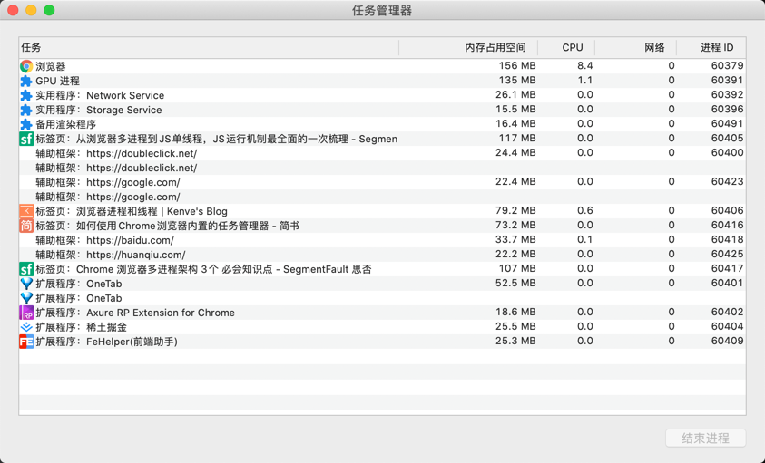

# 进程 & 线程
## 简单区分进程 & 线程
```text
1. CUP => 城市
    - CPU 是计算机中的核心，承担所有的计算任务。
    
2. 进程 => 城市中的工厂
    - 工厂（进程）具有自己独立的内存、资源等。
    - 每个工厂（进程）互不影响 
    
3. 线程 => 工厂中的工人
    - 单线程：工厂（进程）中只有一个工人（线程）  
      多线程：工厂（进程）中有多个工人（线程）一起配合完成工作
    - 同一工厂（进程）下的工人（线程）共享同一工厂资源（代码段、数据集、堆等）
```
#### 小结：
- **进程：** 进程是`CPU`资源分配的最小单位。（拥有资源和独立运行的最小单位）
- **线程：** 是CPU调度的最小单位。（线程是进程基础上的最小单位）


- 一个线程一定属于一个进程；
- 一个进程中可以有很多线程；
- 各个进程互不影响；
  进程中的线程挂掉会影响到整个进程挂掉；

## 浏览器多进程架构
首先，计算机是多进程架构。多进程的好处体现在：例如你可以边使用QQ音乐听歌，边用编辑器敲代码。两个进程互不影响，如果QQ音乐卡死并不会影响到编辑器。

再来看浏览器，目前的**`Chrome`浏览器使用多进程来隔离不同的网页**。

可以通过`Chrome 右上角操作菜单 -> 更多工具 -> 任务管理器`查看所有进程。


### 为什么Chrome要设计为多进程架构？
在前端刚刚兴起时，网页的内容十分简单，消耗的资源很小，所以将浏览器设计为单进程多进程是可行的。随着需求发展，前端页面展示的功能和用户的交互日益增多，此时单进程多线程存在诸多问题：

- 一个`Tab`(网页)崩溃，会影响到所有浏览器页面；
- 第三方插件崩溃，也会影响到浏览器；
- 一个进程下的线程会共享资源，会存在安全隐患；等...

当然，多进程对资源消耗也会更大。
