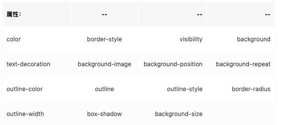
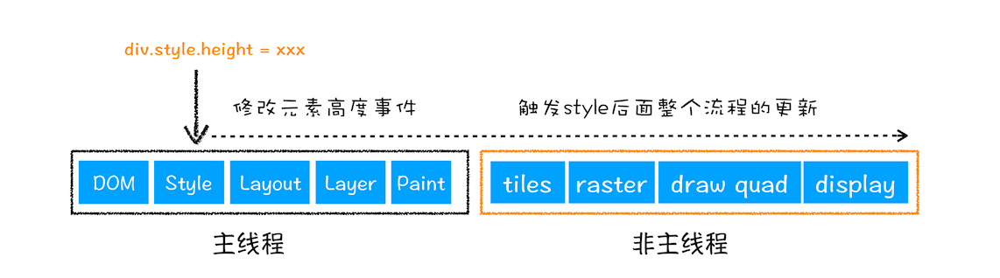
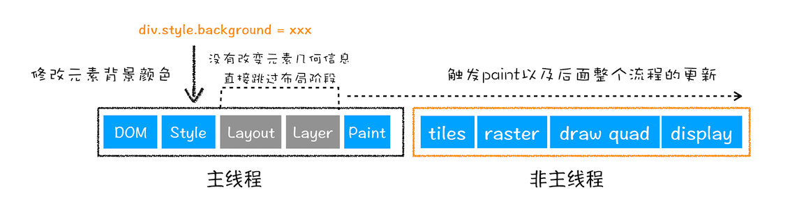
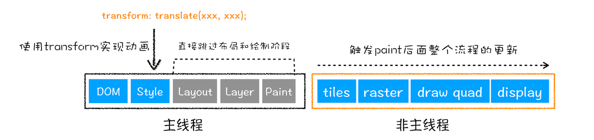

# 回流 & 重绘
网页在生成的时候，至少会渲染一次。在用户还会操作页面，不断的触发回流(`reflow`)和重绘(`repaint`)。
**回流一定会引起重绘，但是重绘不一定会引起回流**

## 回流 reflow
当`DOM`的变化影响了元素的几何信息（元素的位置和尺寸大小），浏览器需要重新计算元素的几何属性，将其安放在界面中的正确位置的过程叫做回流。

> 回流也叫重排：`reflow`翻译后也是回流的意思，之所于别名叫重排，可能是因为更好理解。
### 引起回流常见属性和方法
**任何改变可见`DOM`的几何信息的操作都会引起回流操作。**【前提是可见`DOM`！！！】

1. 添加、删除**可见**的`DOM`元素
2. `DOM`尺寸改变
   - 例：边距、填充、边框、宽度、高度
3. `DOM` 位置变化 
   - 例：`padding`、`margin`
4.  获取`DOM`的偏移量属性
    - 例：如果获取元素的`scrollTop`、`scrollLeft`、`scrollWidth`、`offsetTop`、`offsetLeft`、`offsetWidth`、`offsetHeight`
    这类的属性，浏览器为了保证取值的正确性，也会执行回流操作
5. 内容变化，例：`input`中输入文字
6. 浏览器窗口尺寸改变，例：触发`resize`

### 回流影响范围
由于浏览器是基于流式布局的，当触发回流是会对周围`DOM`进行重新排列，其影响的范围有两种：
#### 全局范围回流
指从根节点`HTML`开始对整个渲染树进行重新布局。
例：
```html
<body>
  <div>
    <h4>hello</h4>
    <p>Mo cha</p>
  </div>
</body>
```
当`p`元素发生回流时，会导致全文档重新布局。
#### 局部范围回流
例如：一个具有复杂动画的元素，对其使用定位，使其脱离文档流。当触发动画产生回流时，只会导致自身元素内部的回流，不会影响到其他的元素，这种就叫做局部回流。

回流的代价是高昂的，因为回流需要重新构建DOM树，也要重新构建渲染树还有执行后续所有步骤。会破坏用户体验，使得页面渲染缓慢，所以要尽量避免触发回流操作。

## 重绘 repaint
当`DOM`的外观发生变化，浏览器需要将其新的外观重新绘制出来的过程，叫做重绘。

### 引起重绘常见属性


## 如何减少回流和重绘？
1. 当批量新增`DOM`时，使用文档碎片`documentFragment`
2. 样式集中改变，使用`cssText`或者更改其`className`
```js
// bad
div.style.width = '100px';
div.style.height = '100px';
div.style.padding = '10px';
```
```js
// good
div.style.cssText = 'width: 100px; height:100px; padding: 10px;'
```
3. 例如具有动画的元素，使用定位脱离文档流，即使回流操作也不会影响其他的元素
4. 动画效果，使用`transition`属性，回流重绘都不会触发，并且会开启`GPU`加速


## 回流 重绘 transition对比
### 回流

### 重绘

### transition动画

