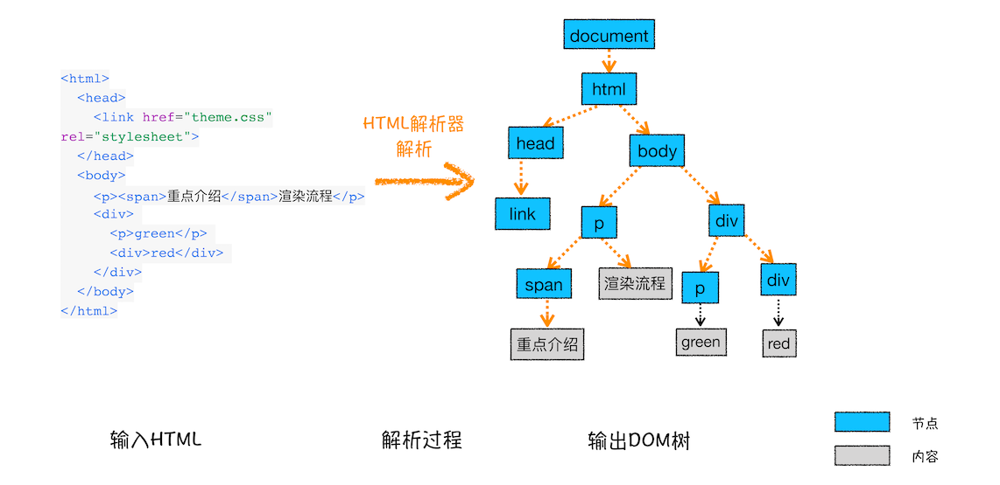
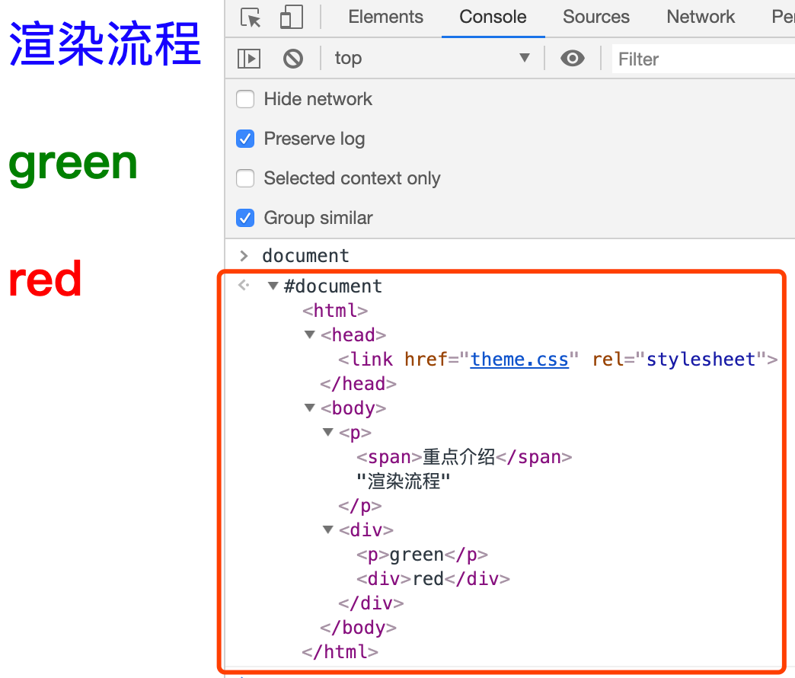
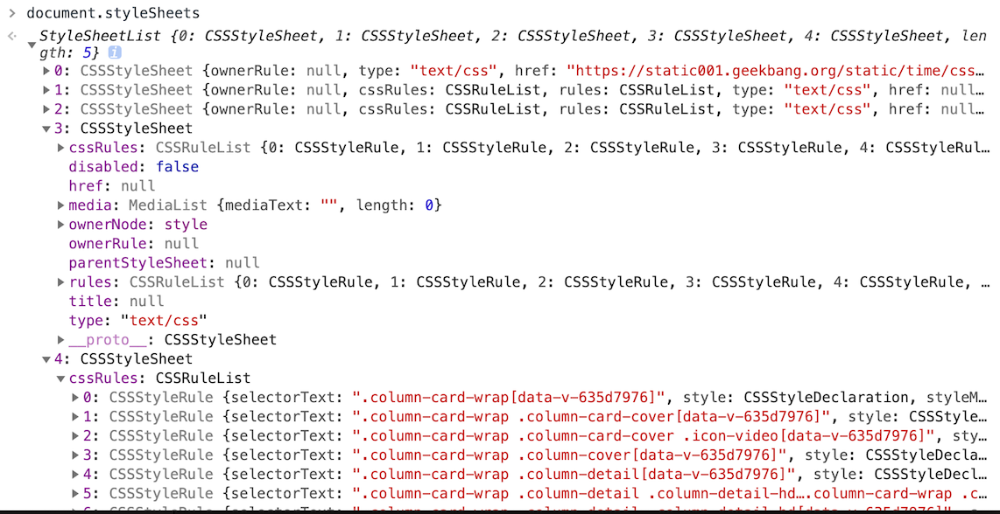
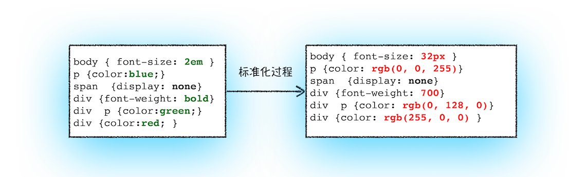
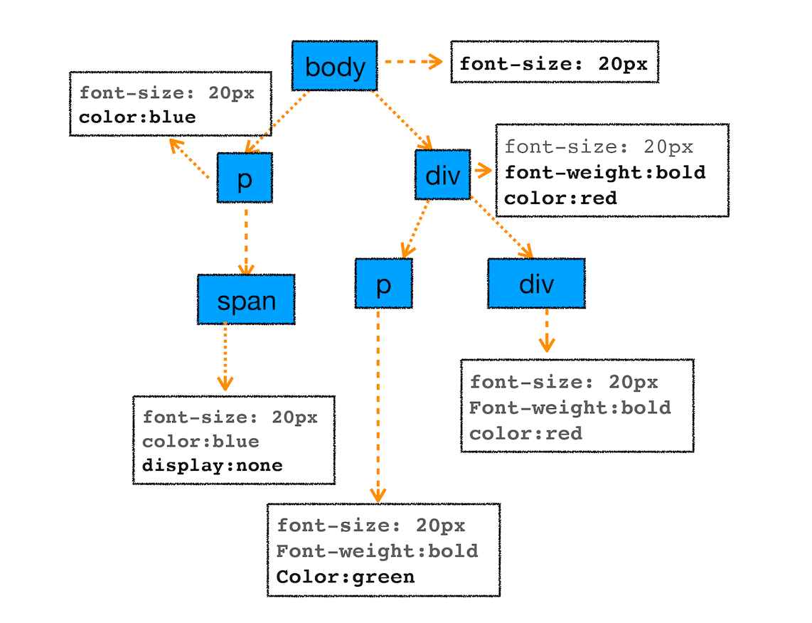

# HTML、CSS、JS是如何变成浏览器页面上的？
通常由开发者编写好的`HTML、CSS、JS`文件，经过浏览器编写就可以形成好看的页面。但是其背后的原理是什么？浏览器在中间做了哪些操作？
通过本文，你可以了解到：`HTML、CSS、JS`是如何变成页面的具体流程。
## 1.构建DOM树
### 为什么要构建DOM树
因为浏览器无法直接解析`HTML`，所以要将`HTML`转换为浏览器可以理解的结构-`DOM`树。
### 构建过程

在控制台打印`document`后，会输出如下的`DOM`树。


## 2.构建CSS树
### 1）收集CSS来源
- 外部样式`<link href="./css"></link>`
- 内部样式`<style></style>`
- 行内样式`<div style="background: red"></div>`

同样，浏览器也无法直接理解纯文本的`CSS`，所以当浏览器接收到CSS时，会将其转换为可理解的`styleSheets`。
在控制打印`document.styleSheets`，会输出以下结果，包含了三种样式来源

### 2）计算其样式表中的属性值，使其标准化
在我们编写代码时，定义的`CSS`样式是这样的：
```css
body { font-size: 2em }
p {color:blue;}
span  {display: none}
div {font-weight: bold}
div  p {color:green;}
div {color:red; }
```
但是对于浏览器来说`em`、`bold`、`green`这样的值是不好理解的，要将其转换为标准化的值，如下：


### 3）计算`DOM`节点中的具体样式
每个`DOM`节点会结合自己本身的样式，和继承其父级的样式，形成具体的样式。
例如：
```css
body { font-size: 2em }
p {color:blue;}
span  {display: none}
div {font-weight: bold}
div  p {color:green;}
div {color:red; }
```
最后经过继承和计算后，会形成如下的`CSS`树。


