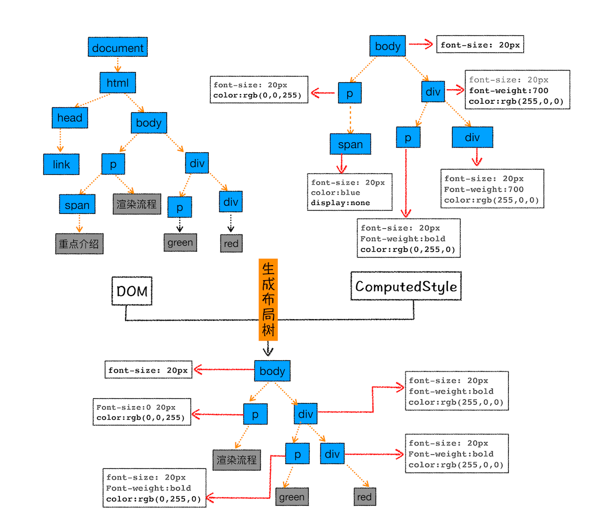
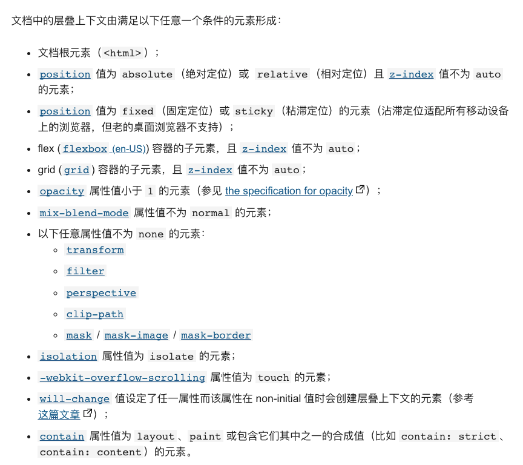
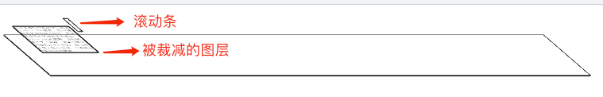

# HTML、CSS、JS是如何变成浏览器页面上的？
通常由开发者编写好的`HTML、CSS、JS`文件，经过浏览器编写就可以形成好看的页面。但是其背后的原理是什么？浏览器在中间做了哪些操作？
通过本文，你可以了解到：`HTML、CSS、JS`是如何变成页面的具体流程。
## 1.构建DOM树
### 为什么要构建DOM树
因为浏览器无法直接解析`HTML`，所以要将`HTML`转换为浏览器可以理解的结构 -- `DOM`树。
### 构建过程
<div style="width:70%;">


</div>

在控制台打印`document`后，会输出如下的`DOM`树。
<div style="width:70%;">


</div>

## 2.构建CSSOM树
同样，浏览器也无法直接理解纯文本的`CSS`，所以当浏览器接收到CSS时，会将其转换为可理解的`styleSheets`。
### 1）收集CSS来源
- 外部样式`<link href="./css"></link>`
- 内部样式`<style></style>`
- 行内样式`<div style="background: red"></div>`

在控制打印`document.styleSheets`，会输出以下结果，包含了三种样式来源
<div style="width:70%;">


</div>

### 2）计算其样式表中的属性值，使其标准化
在我们编写代码时，定义的`CSS`样式是这样的：
```css
body { font-size: 2em }
p {color:blue;}
span  {display: none}
div {font-weight: bold}
div  p {color:green;}
div {color:red; }
```
但是对于浏览器来说`em`、`bold`、`green`这样的值是不好理解的，要将其转换为标准化的值，过程如下：

<div style="width:70%;">


</div>

### 3）计算`DOM`节点中的具体样式
每个`DOM`节点会结合自己本身的样式，和继承其父级的样式，形成具体的样式。
例如：
```css
body { font-size: 2em }
p {color:blue;}
span  {display: none}
div {font-weight: bold}
div  p {color:green;}
div {color:red; }
```
最后经过继承和计算后，会形成如下的`CSS`树。
<div style="width:70%;">


</div>

## 3.合并为渲染树(`render tree`)
此时`DOM`树和`CSSOM`树已经构建完毕，此时需要构建渲染树，然后计算出**可见元素的具体几何信息（元素的尺寸和位置）** 。
### 1）构建布局树

如下图：
<div style="width:70%;">


</div>

**注意：所有不可见的元素都不会构建到渲染树中**

为了构建布局树，浏览器大体上完成了下面这些工作
- 遍历`DOM`树中的所有可见节点，并把这些节点加到布局中；
- 而不可见的节点会被布局树忽略掉，如`head`标签下面的全部内容，再比如`body.p.span`这个元素，因为它的属性包含 `display:none`，所以这个元素也没有被包进布局树
### 2) 计算DOM几何信息
过程比较复杂，略。

## 4.分层
形成布局树后，浏览器依旧无法渲染页面。此时浏览器将对整个页面进行分层的操作。
### 为什么要有分层操作？
页面中会有很多复杂的效果（`3D/动画/页面滚动/zIndex分层`等），为了方便渲染，渲染引擎要将特定的生成图层，并生成图层树。
### 分层的规则？
通常情况，并不是布局树的每个节点都是一个图层，**如果一个节点没有自己的图层，它就从属于父级的图层。**

当满足以下任意一点的元素，就会被单独提升为一个图层：
- 拥有层叠上下文属性的元素
<div style="width:70%;">


</div>

- 需要剪裁的地方也会被创建为图层
- 滚动条也会被单独提升为一个层
```html
 <div style="width:200px;height:100px;overflow: auto">
    <p>在这里我们把div的大小限定为200 * 200像素，而div里面的文字内容比较多，文字所显示的区域肯定会超出200 * 200的面积，这时候就产生了剪裁，渲染引擎会把裁剪文字内容的一部分用于显示在div区域，下图是运行时的执行结果</p>
 </div>
```  
如上所示，外层的`div`定高`100px`，当内部的`p`元素超过`100px`时，会形成滚动条。此时，出现两个图层：



## 5.形成图层待绘制指令列表
在分层操作完成后，渲染引擎会对每个图层分型形成待绘制指令列表，提交到合成线程。

## 6.栅格化操作
**视口**：通常一个页面可能很大，但是用户只能看到其中的一部分，我们把看到的这一部分叫做"视口"。

有些情况下，一个图层可以很大，用户需要一直滑动滚动条才可以看到。如果将一个图层全部绘制出来，没必要也浪费性能。

所以基于这个原因，当接到待绘制列表后，合成线程会执行以下操作：

1. **合成线程会将图层划分为图块**，图块的大小一般是`256 * 256`或是`512 * 512`。
2. 在光栅化线程池中按照视口附近的图块来优先生成位图。

## 7.合成与显示
一旦所有图层被光栅化后，合成线程会生成一个绘制命令`DrawQuad`给浏览器进程，浏览器根据此命令，生成页面，显示到屏幕上。


# 总结
