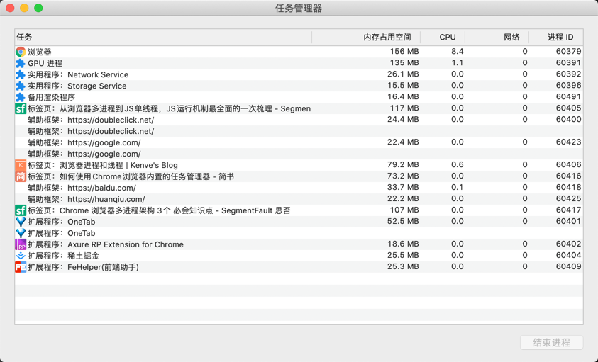
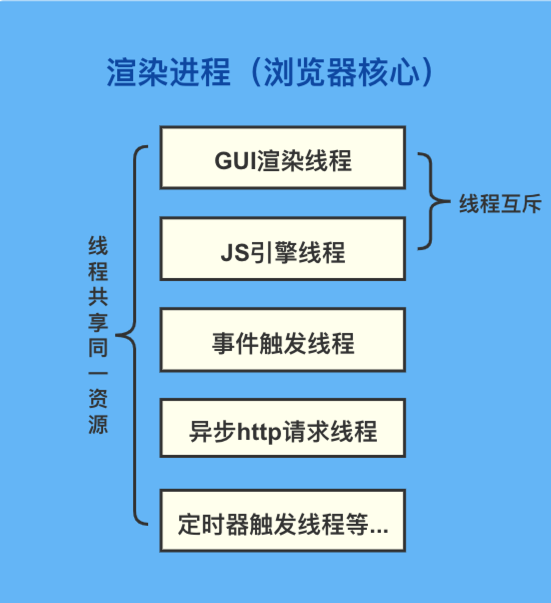

# 进程 & 线程
## 简单区分进程 & 线程
```text
1. CUP => 城市
    - CPU 是计算机中的核心，承担所有的计算任务。
    
2. 进程 => 城市中的工厂
    - 工厂（进程）具有自己独立的内存、资源等。
    - 每个工厂（进程）互不影响 
    
3. 线程 => 工厂中的工人
    - 单线程：工厂（进程）中只有一个工人（线程）  
      多线程：工厂（进程）中有多个工人（线程）一起配合完成工作
    - 同一工厂（进程）下的工人（线程）共享同一工厂资源（代码段、数据集、堆等）
```
#### 小结：
官方描述：
- **进程：** 进程是`CPU`资源分配的最小单位。（拥有资源和独立运行的最小单位）
- **线程：** 是CPU调度的最小单位。（线程是进程基础上的最小单位）

进程&线程特点：
1. 各个进程互不影响，内容相互隔离；
2. 当一个进程关闭后，系统会回收该线程用到资源、内存等...
3. 一个线程一定属于一个进程；一个进程中可以有多个线程
4. 进程中的任一线程挂掉，都会影响到该进程崩溃；
5. 同一进程下的线程共享该进程的资源
  

## 现代浏览器多进程架构
首先，计算机是多进程架构。多进程的好处体现在：例如你可以边使用QQ音乐听歌，边用编辑器敲代码。两个进程互不影响，如果QQ音乐卡死并不会影响到编辑器。

再来看浏览器，`2008`年后，`Chrome`推出了多进程浏览器，所以目前的 **`Chrome`浏览器使用多进程架构**，每一个网页都是一个单独的进程。

可以通过`Chrome 右上角操作菜单 -> 更多工具 -> 任务管理器`查看所有进程。


### 为什么Chrome要设计为多进程架构？
**在2007年以前**，前端刚刚兴起，网页的内容十分简单，消耗的资源很小，所以将浏览器设计为单进程多线程是可行的。随着需求发展，前端页面展示的功能和用户的交互日益增多，此时 单进程多线程 存在诸多问题：

- 不稳定：一个`Tab`(网页)或者第三方插件崩溃，会影响到所有浏览器页面；
- 不流畅：假设在某种情况下`JS`出现了死循环情况，此时`JS`引擎占用了进程大部分的资源，导致整个浏览器变卡顿；
  - 随着`tab`越开越多，页面会越来越卡;
- 一个进程下的线程会共享资源，会存在安全隐患...

总得来说，**浏览器单进程架构具有不安全、不流畅、不稳定的缺点。**

和单进程浏览器相比，现代浏览器具有稳定、流畅、安全等优点，但是也存在一些缺点：
- 占用资源大
- 更复杂的体系结构，导致浏览器各个模块耦合性高、扩展性差

`chrome`开发团队也在逐步解决这些问题，进一步设计浏览器架构。
### 浏览器主要包括哪些进程？
- `Browser`进程（浏览器主进程，只有一个）：
    - 负责地址栏、书签栏、前进后退等部分工作
    - 负责各个`tab`（网页）的管理，创建销毁进程
    - 网络资源的管理及下载
- `Renderer`进程（浏览器核心/浏览器渲染进程）：
    - 负责一个`tab`内关于网页呈现的所有事情、例如脚本执行、页面渲染、事件处理等...
- 第三方插件进程：
    - 每个插件对应一个进程，进程仅在插件使用时创建，如`flash`插件
- `GPU`进程：
    - 最多一个，用于绘制`3D`
- 网络进程：
    - 主要负责页面的网络资源加载

我们在这里主要介绍浏览器的`Renderer`进程（也叫浏览器核心/渲染进程）。

## 渲染进程（浏览器核心）
从以上内容我们已经知道，`Chrome`会为每个网页单独启用进程，进程直接互不影响，所以每个`tab`都有其独立的渲染引擎实例。

### 浏览器核心是多线程
**敲重点：浏览器核心是多线程的。** 页面的渲染、`js`的执行、事件的循环都在这个进程内进行，接下来列举一些常驻线程：
- `GUI`渲染线程
- `JS`引擎线程
- 事件触发线程
- 异步`http`请求线程
- 定时器触发线程



### | `GUI`渲染线程
负责渲染浏览器界面`HTML`元素，当页面发生重绘或者回流时，该线程会执行。在`js`引擎运行脚本期间，`GUI`线程会被挂起。
### | `JS`引擎线程
`JS`引擎，主要负责`JS`脚本的运行和处理。
#### `JS`是单线程的？
为什么`JS`要被设计为单线程的？

由于`JS`这门语言当初设计的初衷就是为了处理用户和网页的交互，如果`JS`是多线程的，可能会出现`UI`冲突的现象：

例：如果`JS`是多线程的，那么可能一个线程是删除`DOM`，一个线程是点击`DOM`，此时会产生冲突，需要浏览器来裁决哪个线程的优先级更高。

虽然可以通过给线程加锁的方式解决这个问题，但是为了避免引入锁带来的复杂性，`JS`在设计当初就采用了单线程执行。
#### `JS`引擎线程与`GUI`线程相互互斥！
由于`JS`可以操作`DOM`节点，如果在运行`JS`同时渲染页面（即：`JS`引擎线程和`GUI`线程同时运行），那么渲染结果将是不可预期的。
为了使得渲染结果符合预期，**浏览器设置`GUI`线程和`JS`引擎是互斥的，当`JS`引擎执行时，`GUI`线程会被挂起，`GUI`更新会被保存到一个队列中，待引擎线程为空后立即被执行**

#### `JS`会阻塞页面加载
由上可知，`JS`引擎线程与`GUI`线程相互互斥，所以在`JS`引擎执行时，`GUI`会被挂起，待`JS`执行完成后，再执行`GUI`线程。
因此`JS`会阻塞页面渲染，所以当`JS`代码运行时间过长时，用户会感到页面不流畅，体验不佳。

#### `<script>`标签阻塞页面渲染
当浏览器遇到脚本外部或内部`<script src=""></script>`时：浏览器必须等脚本下载完，并执行结束，之后才能继续处理剩余的页面，如果`js`执行的时间过长，会阻塞页面渲染，出现"白屏"，降低用户体验。
所以我们一般将`script`放在页面的底部，但是这并不是一个完美的解决方案。
由于放在了页面的底部，导致只有当`HTML`全部加载完毕后，才会执行到`script`，对于很长的`HTML`来说，可能会造成明显的延迟。

**解决方案：** 使用`<script>` 特性（`attribute`）可以为我们解决这个问题：`defer` 和 `async`。

- `defer`属性告诉浏览器不要等待脚本，浏览器将继续处理 `HTML`，构建 `DOM`。脚本会“在后台”下载，然后等 `DOM` 构建完成后，脚本才会执行。
- `async`特性与 `defer` 有些类似，但是`async`不会等待任何脚本，加载完毕就执行。不会像`defer`一样，等待 `DOM` 构建完成后，脚本才会执行。

|     | 顺序  | `DOMContentLoaded`  |
|  ----  | ----  | ----  |
| async  | **加载优先顺序。**<br/>脚本在文档中的顺序不重要 —— 先加载完成的先执行 | 不相关。可能在文档加载完成前加载并执行完毕。如果脚本很小或者来自于缓存，同时文档足够长，就会发生这种情况。  |
| defer  | **脚本在文档顺序中的优先**<br/>脚本在文档中的顺序非常重要，即使后面的脚本先加载完毕，也会等待前面的加载完毕后再执行 | 在文档加载和解析完成之后（如果需要，则会等待），即在 `DOMContentLoaded` 之前执行。| 


### | 定时触发线程
浏览器计数器（`setTimeout`和`setInterval`）并不是由`JS`引擎进程计数的，因为`JS`引擎是单线程的，如果处于堵塞进程就会影响计时器的准确性，所以需要单启一个线程来计时更为准确。

### | 异步`http`请求线程
在`XMLHttpRequest`在连接后通过浏览器新开启一个线程请求，当异步请求状态发生改变时，将其对应的回调函数放置到`JS`引擎的处理队列中等待处理。

### | 事件触发线程
当一个事件被触发时该线程会将事件添加到待处理队列的队尾，等待`JS`引擎的处理。（事件：鼠标点击、`AJAX`请求等).
